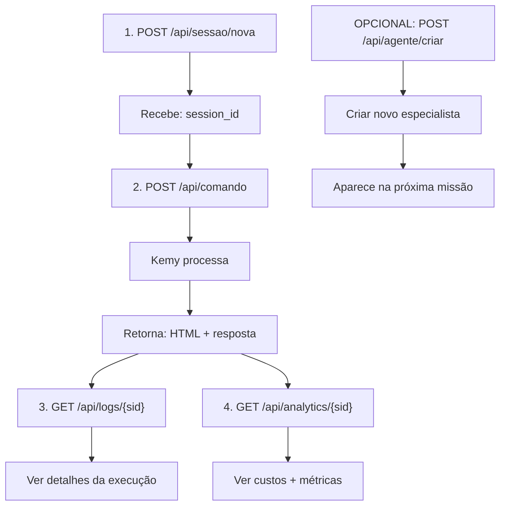

# 📡 Kemy AI — Referência Completa de APIs

## Base URL

- **Desenvolvimento:** `http://localhost:8000`
- **Produção (Render):** `https://seu-app.onrender.com`
- **Documentação Swagger:** `{base-url}/docs`
- **Documentação ReDoc:** `{base-url}/redoc`

---

## 🔑 Autenticação

Atualmente: **Sem autenticação** (recomenda-se adicionar em produção com JWT).

---

## 📋 Endpoints de Sessão

### 1. Criar Nova Sessão

```http
POST /api/sessao/nova
```

**Resposta (200):**
```json
{
  "session_id": "550e8400-e29b-41d4-a716-446655440000",
  "mensagem": "Kemy AI pronta. Qual é a missão?"
}
```

**Caso de Uso:** Iniciar nova conversa com a IA

---

### 2. Listar Sessões Ativas

```http
GET /api/sessao/listar
```

**Resposta (200):**
```json
{
  "sessoes": [
    {
      "session_id": "550e8400-e29b-41d4-a716-446655440000",
      "criada_em": "2025-05-04T10:30:15.123456",
      "ultima_atividade": "2025-05-04T10:35:20.654321",
      "tem_codigo": true,
      "mensagens": 5
    }
  ]
}
```

---

### 3. Obter Histórico de Sessão

```http
GET /api/sessao/{session_id}/historico
```

**Parâmetros de Path:**
- `session_id` (string): UUID da sessão

**Resposta (200):**
```json
{
  "session_id": "550e8400-e29b-41d4-a716-446655440000",
  "historico": [
    {
      "usuario": "Crie uma landing page",
      "kemy": "Iniciando pipeline...",
      "ts": "2025-05-04T10:30:15.123456"
    }
  ]
}
```

---

### 4. Limpar Sessão

```http
POST /api/sessao/{session_id}/limpar
```

**Resposta (200):**
```json
{
  "status": "ok",
  "mensagem": "Memória da sessão limpa."
}
```

**Nota:** Remove código gerado e histórico. Sessão continua ativa.

---

## 🎯 Endpoints de Execução

### 5. Executar Comando / Missão

```http
POST /api/comando
Content-Type: application/json
```

**Body:**
```json
{
  "mensagem": "Crie uma landing page de SaaS moderno com 3 planos de preço",
  "imagem_base64": "data:image/png;base64,iVBORw0KGg...",
  "session_id": "550e8400-e29b-41d4-a716-446655440000"
}
```

**Parâmetros:**
- `mensagem` (string, obrigatório): Descrição da tarefa (min 3 caracteres)
- `imagem_base64` (string, opcional): Imagem em base64 para análise visual
- `session_id` (string, opcional): Se omitido, cria nova sessão

**Resposta (200):**
```json
{
  "status": "sucesso",
  "session_id": "550e8400-e29b-41d4-a716-446655440000",
  "resposta": "Análise completa do projeto...",
  "codigo_gerado": "<html>...</html>",
  "html_valido": true
}
```

**Erros:**
- `503 Service Unavailable`: Todos os motores LLM falharam

---

## 🤖 Endpoints de Agentes

### 6. Criar Agente Customizado

```http
POST /api/agente/criar
Content-Type: application/json
```

**Body:**
```json
{
  "nome": "SEO Specialist",
  "cargo": "Especialista em SEO e Growth",
  "objetivo": "Otimizar conteúdo para mecanismos de busca",
  "backstory": "Você é especialista em SEO com 8 anos de experiência...",
  "motor": "groq",
  "pasta_rag": "./conhecimento/seo_specialist"
}
```

**Parâmetros:**
- `nome` (string): Nome do agente
- `cargo` (string): Título/role do agente
- `objetivo` (string): O que o agente faz
- `backstory` (string, opcional): Contexto e personalidade
- `motor` (string): `gemini`, `groq`, `cerebras`, ou `openrouter`
- `pasta_rag` (string, opcional): Caminho para pasta de conhecimento

**Resposta (201):**
```json
{
  "status": "criado",
  "arquivo": "agentes_customizados/seo_specialist.yaml",
  "agente": {
    "nome": "SEO Specialist",
    "cargo": "Especialista em SEO e Growth",
    "motor": "groq",
    "criado_em": "2025-05-04T10:30:15.123456"
  }
}
```

---

### 7. Listar Agentes

```http
GET /api/agente/listar
```

**Resposta (200):**
```json
{
  "agentes_fixos": 7,
  "agentes_customizados": [
    {
      "nome": "SEO Specialist",
      "cargo": "Especialista em SEO e Growth",
      "motor": "groq",
      "criado_em": "2025-05-04T10:30:15.123456"
    }
  ]
}
```

---

### 8. Remover Agente

```http
DELETE /api/agente/{slug}
```

**Parâmetros de Path:**
- `slug` (string): Nome do arquivo sem extensão (ex: `seo_specialist`)

**Resposta (200):**
```json
{
  "status": "removido",
  "slug": "seo_specialist"
}
```

---

## 📊 Endpoints de Monitoramento

### 9. Status do Servidor

```http
GET /api/status
```

**Resposta (200):**
```json
{
  "nome": "Kemy AI",
  "versao": "2.0.0",
  "status": "online",
  "sessoes_ativas": 3,
  "motores": {
    "gemini": {
      "usos_min": 8,
      "limite": 60,
      "livre": true,
      "pct": 13.3
    },
    "groq": {
      "usos_min": 12,
      "limite": 30,
      "livre": true,
      "pct": 40.0
    },
    "cerebras": {
      "usos_min": 5,
      "limite": 40,
      "livre": true,
      "pct": 12.5
    },
    "openrouter": {
      "usos_min": 0,
      "limite": 100,
      "livre": true,
      "pct": 0.0
    }
  },
  "cache": {
    "tipo": "Redis",
    "memoria_mb": "2.5M",
    "keys": 42,
    "conectado": true
  }
}
```

**Interpretação:**
- `pct`: Percentual de rate limit atingido
- Se `pct` > 80%, próximas chamadas podem falhar
- `cache.tipo`: Tipo de cache (Redis ou Memória Local)

---

### 10. Logs Estruturados

```http
GET /api/logs/{session_id}
```

**Parâmetros de Path:**
- `session_id` (string): UUID da sessão

**Resposta (200):**
```json
{
  "session_id": "550e8400-e29b-41d4-a716-446655440000",
  "total": 15,
  "logs": [
    {
      "ts": "2025-05-04T10:30:15.123456",
      "sid": "550e8400-e29b-41d4-a716-446655440000",
      "nivel": "info",
      "agente": "KEMY",
      "msg": "Missão recebida.",
      "dados": {
        "msg": "Crie uma landing page de SaaS..."
      },
      "elapsed_s": 0.12
    },
    {
      "ts": "2025-05-04T10:30:20.654321",
      "sid": "550e8400-e29b-41d4-a716-446655440000",
      "nivel": "info",
      "agente": "VISAO",
      "msg": "Laudo gerado.",
      "dados": {
        "chars": 1024
      },
      "elapsed_s": 5.4
    }
  ]
}
```

**Níveis:** `info`, `alerta`, `erro`

---

### 11. Analytics de Sessão

```http
GET /api/analytics/{session_id}
```

**Parâmetros de Path:**
- `session_id` (string): UUID da sessão

**Resposta (200):**
```json
{
  "session_id": "550e8400-e29b-41d4-a716-446655440000",
  "total_eventos": 8,
  "resumo": {
    "tempo_total_s": 45.3,
    "tokens_total": 8540,
    "custo_total_usd": 0.0342,
    "taxa_sucesso_pct": 100.0,
    "tempo_medio_s": 5.66
  },
  "por_agente": {
    "brenno": {
      "chamadas": 1,
      "tempo_total": 8.2,
      "custo": 0.0089
    },
    "diego": {
      "chamadas": 1,
      "tempo_total": 10.5,
      "custo": 0.0064
    },
    "paulo": {
      "chamadas": 1,
      "tempo_total": 12.1,
      "custo": 0.0071
    },
    "felipe": {
      "chamadas": 1,
      "tempo_total": 9.8,
      "custo": 0.0065
    },
    "bianca": {
      "chamadas": 1,
      "tempo_total": 2.4,
      "custo": 0.0028
    },
    "leonardo": {
      "chamadas": 1,
      "tempo_total": 2.3,
      "custo": 0.0025
    }
  },
  "ultimos_10_eventos": [...]
}
```

**Interpretação:**
- `tokens_total`: Soma de entrada + saída (tokens gastos)
- `custo_total_usd`: Estimativa de custo da missão
- `taxa_sucesso_pct`: Percentual de sucesso dos agentes

---

### 12. Status do Cache

```http
GET /api/cache/status
```

**Resposta (200):**
```json
{
  "cache": {
    "tipo": "Redis",
    "memoria_mb": "5.2M",
    "keys": 127,
    "conectado": true
  }
}
```

---

## 🌍 Endpoint Raiz

### 13. Info Geral

```http
GET /
```

**Resposta (200):**
```json
{
  "nome": "Kemy AI",
  "versao": "2.0.0",
  "status": "online",
  "docs": "/docs"
}
```

---

## 🔄 Fluxo Típico de Uso



---

## 🚨 Códigos de Erro

| Código | Erro | Solução |
|--------|------|--------|
| 400 | Bad Request | Verifique JSON e tipos de dados |
| 404 | Not Found | Session_id não existe |
| 409 | Conflict | Agente com esse nome já existe |
| 503 | Service Unavailable | Todos os LLMs falharam — verifique chaves de API |

---

## 📦 Exemplo Completo (Python)

```python
import requests
import json

BASE_URL = "http://localhost:8000"

# 1. Criar sessão
r = requests.post(f"{BASE_URL}/api/sessao/nova")
session_id = r.json()["session_id"]

# 2. Executar comando
r = requests.post(f"{BASE_URL}/api/comando", json={
    "mensagem": "Crie um footer com redes sociais",
    "session_id": session_id
})
resultado = r.json()
print(f"HTML gerado: {resultado['html_valido']}")

# 3. Ver logs
r = requests.get(f"{BASE_URL}/api/logs/{session_id}")
logs = r.json()["logs"]
for log in logs:
    print(f"[{log['nivel']}] {log['agente']}: {log['msg']}")

# 4. Ver custo
r = requests.get(f"{BASE_URL}/api/analytics/{session_id}")
analytics = r.json()
print(f"Custo total: ${analytics['resumo']['custo_total_usd']}")
```

---

## 🔐 Segurança

- ✅ Validar `session_id` em produção (adicionar autenticação)
- ✅ CORS configurável via `ORIGENS_CORS`
- ✅ Rate limiting automático por motor LLM
- ✅ Logs estruturados com compliance

---

## 📞 Suporte

- Issues: GitHub Issues
- API Docs: `/docs` (Swagger interativo)
- ReDoc: `/redoc` (Documentação visual)
